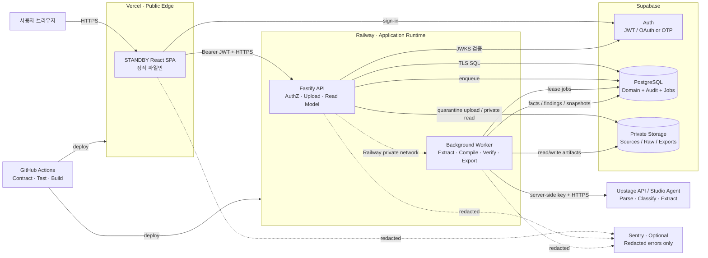
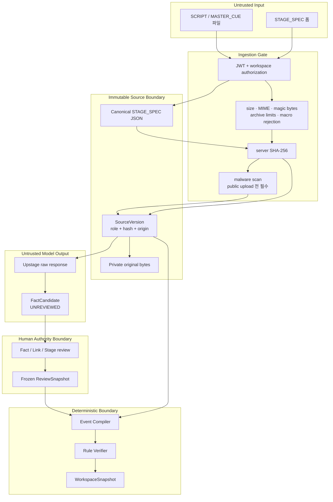
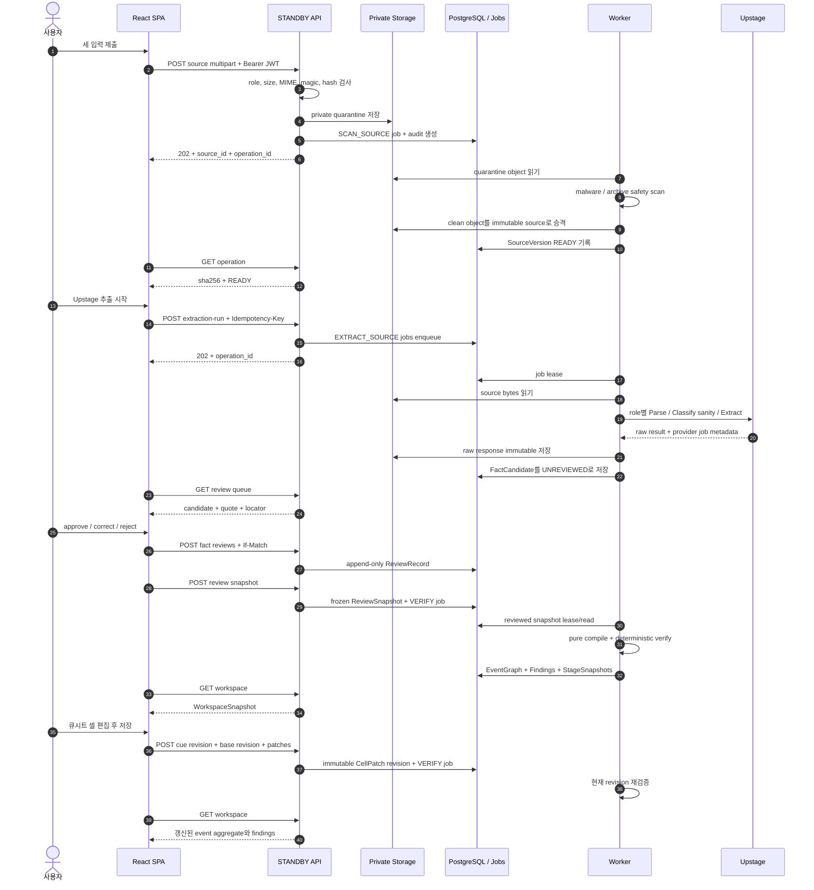
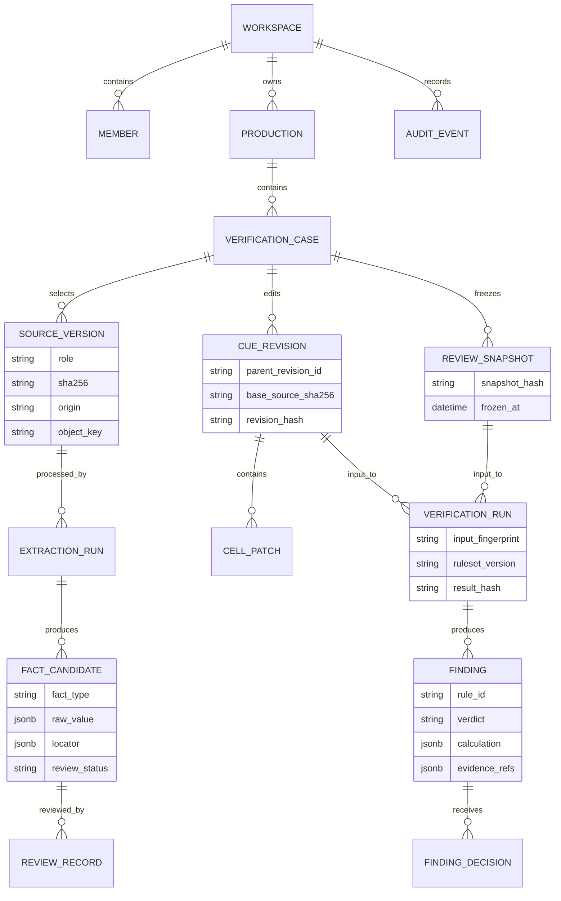

# STANDBY Backend Architecture

| 항목 | 내용 |
|---|---|
| 문서 상태 | Draft v1.0 — 구현 기준안 |
| 기준일 | 2026-08-22 |
| 상위 제품 계약 | [PRD_CLAUDE.md](PRD_CLAUDE.md) |
| UI 계약 | [DESIGN.md](../Lo-Fi/standby/DESIGN.md) |
| 데이터 계약 | [JSON_CONTRACT.md](JSON_CONTRACT.md) |
| 핵심 원칙 | Verifier first · Evidence always · Human decides |

이 문서는 현재 두 화면과 앱 내 revision 모델을 실제 서버로 옮기기 위한 배포·데이터·보안 설계다.
제품 정의를 바꾸지 않으며, 오래된 외부 재업로드/별도 Final 화면 흐름이 남아 있는
`API_SPEC.md`와 `openapi.yaml`은 구현 전에 이 문서와 현재 PRD에 맞춰 축소해야 한다.

> **2026-08-22 공개 MVP 예외:** 현재 데모 런타임은 로그인 UI를 제외하고 브라우저 UUID 세션,
> 세션별 owner 격리, extraction IP rate limit으로 운영한다. 아래 Supabase Auth·Postgres·Storage
> 설계는 고객 문서와 영속 데이터를 받는 운영 제품 전환안이며 현재 런타임을 설명하지 않는다.

---

## 0. 결정 요약

### 채택

- **모듈러 모놀리스**: API와 worker는 같은 TypeScript 코드베이스를 사용하고 process만 분리한다.
- **서버 판정**: compiler와 verifier는 네트워크·LLM 호출이 없는 결정론적 모듈이다.
- **불변 원본**: SCRIPT, MASTER_CUE, STAGE_SPEC는 `SourceVersion`과 SHA-256으로 고정한다.
- **검토된 snapshot**: Upstage 결과는 모두 `UNREVIEWED`; 사람이 승인한 `ReviewSnapshot`만 verifier가 읽는다.
- **PostgreSQL job queue**: extraction, verification, export를 durable job으로 실행한다.
- **private object storage**: 원본, Upstage raw 응답, export 결과를 DB 밖에 저장한다.
- **집계 read model**: 프론트는 raw JSON이 아니라 `WorkspaceSnapshot`만 받는다.

backend의 canonical source role은 `SCRIPT | MASTER_CUE | STAGE_SPEC`이다. 현재 UI의 `CUESHEET`
표시는 사람이 이미 통합한 `MASTER_CUE`의 화면 라벨로 매핑한다.

### 채택하지 않음

- 마이크로서비스, Redis, Kafka, 벡터 DB, RAG
- LLM이 verdict나 `CONSISTENT`를 결정하는 경로
- 브라우저에서 Upstage 직접 호출
- 브라우저에서 database 또는 service-role key 직접 사용
- 실시간 WebSocket, 서버 측 재생 상태, 좌표 보간
- 공개 URL로 원본 문서 제공

---

## 1. 연결할 서비스

### 기본안 — 해커톤과 초기 베타

| 서비스 | 책임 | 필수 여부 | 비고 |
|---|---|---:|---|
| **Vercel** | 기존 Vite/React 정적 프론트 배포 | 필수 | API key나 DB secret을 넣지 않는다 |
| **Railway** | Fastify API와 background worker 실행 | 필수 | 같은 repo, 다른 start command |
| **Supabase Auth** | 로그인, JWT 발급 | 필수 | MVP는 email OTP 또는 한 OAuth provider만 |
| **Supabase Postgres** | domain state, review, revision, finding, audit, job queue | 필수 | worker는 direct/session-mode 연결 사용 |
| **Supabase Storage** | 원본·raw response·export의 private bucket | 필수 | public bucket 금지 |
| **Upstage** | Parse, role sanity Classify, 역할별 Extract | 필수 | verdict 생성 금지 |
| **GitHub Actions** | schema, test, typecheck, build, migration check | 필수 | 배포 전 계약 검증 |
| **Sentry** | client/server 오류 추적 | 선택 | PII와 source quote scrubbing 후 연결 |

Supabase는 Auth·Postgres·Storage를 한 프로젝트에서 제공해 서비스 수를 줄인다. Railway에는 API와
worker만 둔다. API와 worker 사이 통신은 Railway private network를 쓰고, Supabase 연결은 TLS를
사용한다. persistent worker는 Supabase direct connection이 가능하면 direct, 아니면 session-mode
pooler를 사용한다. transaction-mode pooler는 long-lived queue worker에 사용하지 않는다.

### 공개 데모 정책

- 현재 해커톤 데모는 로그인 없이 문서를 업로드할 수 있다.
- 브라우저 UUID를 해시한 actor ID로 case를 격리하고 extraction을 IP당 시간당 20회로 제한한다.
- UUID는 신원 인증이 아니므로 영속 저장·공유·복구가 필요한 운영 제품에는 사용하지 않는다.
- Vercel preview는 Deployment Protection을 켠다.
- 운영 제품 전환 시 Supabase Auth와 workspace authorization을 다시 적용한다.

---

## 2. 런타임 토폴로지



### 네트워크 원칙

1. public ingress는 Vercel의 정적 SPA와 Railway API 두 곳뿐이다.
2. worker는 public domain을 만들지 않는다.
3. Postgres와 Storage는 public data source가 아니다. 브라우저는 domain data를 항상 API로 받는다.
4. CORS는 production origin과 명시된 preview origin만 허용한다.
5. Upstage 통신은 worker에서만 나간다. API는 provider-specific payload를 노출하지 않는다.

---

## 3. 신뢰 경계와 데이터 흐름



경계의 의미는 명확하다.

- 사용자 파일은 검증 전까지 신뢰하지 않는다.
- Upstage 출력은 구조가 맞아도 사실로 신뢰하지 않는다.
- 사람 검토를 통과한 snapshot만 계산에 쓴다.
- verifier 출력도 안전 인증이 아니라 입력 문서 사이의 양립 가능성 판정이다.

---

## 4. 요청 처리 시퀀스



### Classify 사용 규칙

- 업로드 slot `SCRIPT | MASTER_CUE | STAGE_SPEC`이 역할의 authority다.
- Classify는 자동 라우터가 아니라 **role mismatch sanity check**다.
- Classify 결과가 slot과 다르면 자동 교체하지 않고 `ROLE_MISMATCH_REVIEW`로 멈춘다.
- STAGE_SPEC 폼은 사람이 직접 확정한 canonical JSON이므로 Upstage 호출이 필요 없다.
- STAGE_SPEC 파일 입력을 추가하는 경우에만 Extract 후보와 별도 review를 사용한다.

---

## 5. 서버 모듈

```text
server/
  src/
    http/                 # Fastify routes, auth, validation, read models
    domain/
      sources/            # immutable SourceVersion, hash, origin
      reviews/            # fact/link/stage review and snapshots
      revisions/          # CellPatch and history/restore
      compiler/           # reviewed facts -> EventGraph
      verifier/           # VR-00~03 pure rules
      workspace/          # UI projection
    adapters/
      upstage/            # provider request, polling, raw preservation, decode
      storage/            # private object interface
      workbook/           # XLSX native locator and round-trip
    jobs/                 # EXTRACT_SOURCE, VERIFY, EXPORT_XLSX
    security/             # authz, quotas, upload gate, redaction
    db/                   # schema, migrations, repository implementations
contracts/                # JSON Schema and fixtures shared with app/server
```

API와 worker가 `domain/`을 같이 사용한다. 별도 repository나 서비스로 쪼개지 않는다.

---

## 6. 데이터 소유권과 JSON 계약

### 계약 층

| 계약 | 생성자 | 수정 가능 여부 | consumer |
|---|---|---:|---|
| `standby.source.v1` | API | 불변 | adapter, audit |
| `standby.extraction.v1` | Upstage adapter | raw 불변 | reviewer |
| `standby.stage-spec.v1` | API form adapter | 새 version만 생성 | compiler |
| `standby.review-snapshot.v1` | review service | 동결 후 불변 | compiler |
| `standby.event-graph.v1` | compiler | run별 불변 | verifier, simulator |
| `standby.verification.v1` | verifier | run별 불변 | workspace |
| `standby.revision.v1` | revision service | append-only | compiler, XLSX export |

### 핵심 식별자

- `source_sha256`: 서버가 원본 bytes에서 계산한다.
- `source_snapshot_digest`: SCRIPT → MASTER_CUE → STAGE_SPEC 고정 순서의 role/hash digest다.
- `fact_snapshot_digest`: freeze 시점 fact 후보 전체를 `fact_id` 순서로 canonical hash한 값이다.
- `extraction_fingerprint`: source hash + role + agent/config + schema + decoder version이다.
- `verification_fingerprint`: review snapshot + cue revision + ruleset + compiler/verifier version이다.
- ID, hash, origin, review status, verdict는 모델이 생성하지 않는다.

### 상태 분리

| 축 | 값 |
|---|---|
| 처리 | `QUEUED | RUNNING | READY | FAILED` |
| fact 검토 | `UNREVIEWED | REVIEWED | REJECTED` |
| finding verdict | `VIOLATION | REVIEW | INSUFFICIENT_EVIDENCE` |
| 이벤트 집계 | `CONSISTENT | HAS_FINDING` |
| 셀 편집 | `CLEAN | EDITED` |
| 사람 판단 | 별도 `FindingDecision` record |

`CONSISTENT`와 `EDITED`를 finding verdict enum에 넣지 않는다.

### XLSX 원본 보존

Upstage는 의미 추출을 담당하지만 workbook 왕복의 authority가 아니다.

1. native XLSX adapter가 sheet 이름, cell 주소, 원본 workbook bytes와 hash를 보존한다.
2. 사람이 저장한 셀만 `CellPatch`로 기록한다.
3. export worker가 원본 workbook의 해당 cell에만 patch를 적용해 새 파일을 만든다.
4. verdict는 workbook에 쓰지 않는다.
5. export 결과를 재입력했을 때 동일 fact가 나오는 fixture test를 둔다.

---

## 7. 최소 데이터 모델



원본 파일과 provider raw response는 object storage에 두고 DB에는 object key와 hash만 둔다.
fact, locator, calculation처럼 shape가 진화하는 값은 JSONB로 저장하되 workspace·case·status·version은
일반 column과 foreign key로 강제한다.

---

## 8. 최소 API 경계

### 입력 화면

- `POST /v1/cases`
- `POST /v1/cases/{case_id}/sources/{role}` — multipart upload 또는 STAGE_SPEC JSON
- `GET /v1/cases/{case_id}/sources`
- `POST /v1/cases/{case_id}/extraction-runs`
- `GET /v1/operations/{operation_id}`
- `GET /v1/cases/{case_id}/review-queue`
- `POST /v1/cases/{case_id}/fact-reviews:batch`
- `POST /v1/cases/{case_id}/review-snapshots`

### 워크스페이스

- `GET /v1/cases/{case_id}/workspace`
- `GET /v1/findings/{finding_id}`
- `POST /v1/findings/{finding_id}/decisions`
- `POST /v1/cases/{case_id}/cue-revisions`
- `GET /v1/cases/{case_id}/cue-revisions`
- `POST /v1/cue-revisions/{revision_id}:restore` — 과거 내용을 복사한 새 child revision 생성
- `POST /v1/cue-revisions/{revision_id}/exports`
- `GET /v1/artifacts/{artifact_id}/download` — auth 후 짧은 signed URL 또는 stream

### 공통 규칙

- state-changing `POST`는 `Idempotency-Key`를 요구한다.
- review·revision command는 `If-Match`로 stale overwrite를 막는다.
- async command는 `202`, `operation_id`, `Retry-After`를 반환한다.
- tenant/workspace는 JWT와 membership으로 결정하며 body 값을 신뢰하지 않는다.
- source bytes, raw Upstage response, API key는 일반 응답에 포함하지 않는다.

---

## 9. Job과 장애 복구

### Job 종류

| job | 입력 fingerprint | retry |
|---|---|---|
| `SCAN_SOURCE` | source SHA-256 + scanner version | 일시적 scanner 오류만 |
| `EXTRACT_SOURCE` | source + role + config + schema + decoder | 429/5xx backoff; 모호한 submit은 정지 |
| `VERIFY` | review snapshot + cue revision + ruleset | 결정론적이므로 안전한 retry |
| `EXPORT_XLSX` | base workbook + ordered patches + exporter version | 안전한 retry |
| `PURGE_CASE` | case + retention version | audit metadata만 남김 |

### 실행 규칙

- worker는 Postgres row lease로 job을 한 번만 소유한다.
- retry는 exponential backoff + jitter를 사용한다.
- 같은 source hash와 extraction fingerprint가 있으면 Upstage를 다시 부르지 않는다.
- Upstage submit이 성공했는지 불명확한 timeout은 새 job을 자동 생성하지 않고
  `SUBMISSION_UNKNOWN`으로 멈춘다.
- live upstream 실패 시 controlled fixture의 이전 성공 결과를 데모 fallback으로 사용할 수 있지만
  `result_source=CACHE`를 UI와 audit에 남긴다.
- compiler/verifier는 동일 fingerprint를 세 번 실행해 같은 `result_hash`가 나와야 한다.

---

## 10. 보안 설계

### 10.1 인증과 권한

- 아래 항목은 운영 제품 전환 목표다. 현재 공개 MVP는 상단의 익명 데모 예외를 따른다.
- Supabase Auth JWT는 API가 issuer, audience, expiry, signature를 검증한다.
- 권한은 `OWNER | EDITOR | REVIEWER | VIEWER` 네 개다.
- workspace membership을 모든 case query에 강제한다.
- DB의 exposed schema에는 RLS를 켜고, API 내부 query도 `workspace_id` 조건을 강제한다.
- service-role은 RLS를 우회할 수 있다고 가정한다. 따라서 RLS만 믿지 않고 repository 계층에서
  token-derived `workspace_id`를 필수 인자로 받는다.
- service-role key는 API/worker에만 있고 Vercel client bundle에는 절대 넣지 않는다.
- public demo token은 write 권한을 갖지 않는다.
- access token은 URL이나 로그에 넣지 않고, 공유 demo password/token을 client bundle에 하드코딩하지 않는다.

### 10.2 업로드 보안

- 허용 확장자뿐 아니라 MIME과 magic bytes를 함께 확인한다.
- 파일명은 표시용 metadata로만 보존하고 storage key로 사용하지 않는다.
- OOXML은 압축 해제 크기·파일 수·compression ratio 한도를 검사해 zip bomb를 막는다.
- `.xlsm`, `.docm`, 실행 파일, password-protected archive는 P0에서 거부한다.
- URL import는 P0에서 제공하지 않아 SSRF 경로를 만들지 않는다.
- public upload를 열기 전 malware scan을 통과시킨다. fixture-only demo에서는 업로드 자체를 닫는다.
- parser는 원본 디렉터리를 실행하거나 shell command로 전달하지 않는다.

### 10.3 AI·prompt injection 경계

- 문서 안의 문장은 전부 untrusted data다. tool instruction으로 실행하지 않는다.
- Upstage는 고정된 role schema로 fact 후보만 반환한다.
- model output은 Ajv strict validation을 통과해야 저장 projection이 된다.
- 모델이 만든 URL, command, file path를 worker가 실행하지 않는다.
- confidence가 높아도 review를 생략하지 않는다.
- compiler/verifier는 LLM이나 외부 네트워크에 접근할 수 없는 pure module로 둔다.

### 10.4 저장·전송·삭제

- 모든 외부 통신은 HTTPS/TLS다.
- Storage bucket은 `quarantine`, `sources`, `provider-raw`, `exports` 모두 private다.
- quarantine object는 scan worker만 읽으며 성공 시 승격, 실패 또는 timeout 시 삭제한다.
- download URL은 서버가 권한 확인 후 짧게 발급한다. URL은 만료 전 강제 회수가 어렵다고 가정한다.
- object key는 `workspace_id/case_id/random_id` 구조이고 사용자가 지정할 수 없다.
- 원본, raw response, export에는 `retention_expires_at`을 둔다.
- demo 기본값은 **우리 storage에서 24시간 후 purge**로 둔다. 실제 공연 문서의 운영 보존기간은
  별도 개인정보·저작권 정책을 확정하기 전 늘리지 않는다.
- purge 후 audit에는 actor, timestamp, 대상 hash만 남기고 원문이나 quote는 남기지 않는다.

### 10.5 Upstage 데이터 정책

- API key는 Railway sealed secret으로 보관하고 worker에만 주입한다.
- 개발·preview·production key와 Agent/config를 분리한다.
- 실제 배우 연락처, 주민번호, 계약금액은 provider 전송 전에 제거한다.
- 해커톤 Studio/Agent 실행은 `CONTROLLED_FIXTURE` 또는 비식별화 문서만 사용한다.
- 공개 약관상 일반 API, async API, Agent/Studio의 보관 조건이 다르므로 실제 고객 문서는
  **direct Parse/Extract를 기본 후보**로 하고 Agent 사용은 보관정책 확인과 동의 후 선택한다.
- provider purge 가능 여부와 retention은 case 화면과 audit에 기록한다. 우리 storage 삭제만으로
  upstream 삭제까지 완료됐다고 표시하지 않는다.

### 10.6 웹 보안

- CORS allowlist, `Content-Security-Policy`, `frame-ancestors`, `nosniff`, strict referrer policy를 적용한다.
- bearer token을 URL/query에 넣지 않는다.
- 사용자 quote는 React text node로만 렌더링하고 raw HTML을 허용하지 않는다.
- 에러 메시지에 SQL, storage key, raw model body, source quote를 넣지 않는다.
- API body와 multipart 크기 한도, endpoint별 rate limit을 둔다.

### 10.7 비용·남용 방지

- 공개 MVP는 익명 세션과 IP당 시간당 20회 제한을 함께 적용한다.
- 운영 제품에서는 인증 사용자만 extraction을 시작할 수 있다.
- workspace별 동시 extraction 수, 일일 page/credit budget, 파일 수·크기 한도를 둔다.
- hash cache hit이면 Upstage를 호출하지 않는다.
- 같은 `Idempotency-Key`의 중복 요청은 기존 operation을 반환한다.
- 429 응답에 `Retry-After`를 포함한다.
- provider 사용량은 source text가 아니라 workspace, role, page count, cost estimate로 기록한다.

### 10.8 백업·공급망

- real customer data를 받기 전 Postgres backup/PITR 지원 plan과 restore 절차를 확인한다.
- object metadata와 DB snapshot의 복구 시점이 다르면 hash 검증으로 불일치를 탐지한다.
- `package-lock.json`을 커밋하고 CI는 `npm ci`를 사용한다.
- dependency audit, secret scan, schema migration dry-run을 GitHub Actions의 merge gate로 둔다.
- third-party GitHub Action은 mutable branch가 아니라 release SHA 또는 검토된 major tag에 고정한다.
- 개발자 local `.env`와 live capture는 git에 넣지 않는다.

### 위협과 통제

| 위협 | 통제 |
|---|---|
| Upstage key 유출 | worker-only sealed secret, 로그 redaction, 환경별 key, 회전 runbook |
| 다른 팀 문서 열람 | JWT-derived workspace, DB RLS, object prefix, cross-tenant integration test |
| 악성 PDF/OOXML | magic bytes, archive limits, macro rejection, malware scan, 실행 금지 |
| prompt injection | fixed schema, no tool execution, strict decoder, human review |
| hallucinated verdict | reviewed snapshot hard gate, deterministic verifier |
| 중복 과금 | hash cache, idempotency key, submit-unknown stop |
| 동시 편집 덮어쓰기 | ETag/`If-Match`, parent revision, append-only patch |
| signed URL 유출 | private bucket, 짧은 TTL, one-object URL, URL 로그 금지 |
| 로그의 대본 유출 | structured allowlist logging, quote/body redaction |
| 공개 데모 남용 | fixture read-only, upload/auth 분리, quota와 rate limit |

---

## 11. 비밀값 배치

| 환경변수 | Vercel SPA | Railway API | Railway Worker |
|---|:---:|:---:|:---:|
| `VITE_API_BASE_URL` | 공개 가능 | — | — |
| `VITE_SUPABASE_URL` | 공개 가능 | — | — |
| Supabase public/anon key | 필요 시 | — | — |
| `SUPABASE_JWKS_URL` | — | 필요 | — |
| `DATABASE_URL` | 금지 | 필요 | 필요 |
| `SUPABASE_SERVICE_ROLE_KEY` | 금지 | 필요 | 필요 |
| `UPSTAGE_API_KEY` | 금지 | 금지 | 필요 |
| `UPSTAGE_AGENT_ID_*` | 금지 | 조회용 registry만 | 필요 |
| `UPSTAGE_CONFIG_ID_*` | 금지 | 조회용 registry만 | 필요 |
| `SENTRY_DSN` | public DSN만 | 선택 | 선택 |

`VITE_` prefix가 붙은 값은 최종 JavaScript bundle에 들어간다고 간주한다. secret에는 절대 붙이지 않는다.

---

## 12. 환경과 배포

| 환경 | 데이터 | Upstage | 접근 |
|---|---|---|---|
| local | 합성 fixture, local Postgres 또는 전용 dev DB | 기본 mock; 명시적 live smoke만 | localhost |
| preview | `CONTROLLED_FIXTURE`만 | dev Agent/config, 낮은 quota | Vercel Protection |
| production demo | 비식별 fixture + 인증 upload | pinned demo Agent/config | public read-only demo + auth write |

- production migration은 API 시작과 분리한 pre-deploy command로 한 번만 실행한다.
- API와 worker는 같은 commit SHA와 contract version을 사용한다.
- worker가 이전 contract version이면 새 job을 lease하지 못하게 한다.
- migration은 forward-only로 작성하고 source bytes를 변환하지 않는다.
- GitHub Actions에서 secret을 사용하는 live Upstage test는 수동 실행만 허용한다.

---

## 13. 관측성과 감사

### 로그에 남기는 것

- `request_id`, actor ID, workspace ID, route, status, latency
- operation ID, job type, attempt, cache hit, upstream job ID
- source role과 hash 앞 12자리, schema/decoder/ruleset version
- finding count, verdict별 count, verification result hash

### 로그에 남기지 않는 것

- 원본 파일명에 포함된 개인정보
- 대본·큐시트 quote와 셀 내용
- raw Upstage request/response body
- JWT, API key, signed URL, database URL

### 필수 audit event

- source upload/confirm/purge
- extraction start/success/failure/cache fallback
- fact/link/stage review
- review snapshot freeze
- cue revision save/restore/export
- verification start/result
- finding decision
- role mismatch와 권한 거부

---

## 14. 구현 순서

### PR 1 — 계약과 보안 경계

1. `contracts/`에 source, extraction, stage-spec, event-graph, verification, revision schema를 둔다.
2. zone 방향, `UNKNOWN`, ordered action, locator, review 상태를 고정한다.
3. valid hero, missing fact, dangling ref, duplicate ID, reversed zone fixture를 검사한다.
4. 현재 `openapi.yaml`을 두 화면과 앱 내 revision endpoint로 축소한다.

### PR 2 — fixture 기반 vertical slice

1. Fastify API, Postgres migration, private storage adapter, job worker를 만든다.
2. 실제 Upstage 없이 세 fixture를 업로드하고 review snapshot을 만든다.
3. E3 `VIOLATION` → R3 셀 저장 → event aggregate `CONSISTENT` 흐름을 검증한다.
4. 이벤트별 `StageSnapshots`를 `WorkspaceSnapshot`으로 반환한다.

### PR 3 — Upstage adapter

1. SCRIPT 한 건, MASTER_CUE 한 건으로 authenticated live capture를 만든다.
2. raw response와 hash를 보존하고 strict decoder를 통과시킨다.
3. role mismatch, locator downgrade, malformed response를 fail-closed로 검사한다.
4. 새 fact가 자동 승인되지 않는지 확인한다.

### PR 4 — XLSX 왕복

1. native workbook locator를 고정한다.
2. `CellPatch`만 적용한 새 XLSX를 export한다.
3. export → import 시 같은 reviewed fact가 나오는지 검증한다.

---

## 15. 출시 전 보안 합격선

- [ ] frontend bundle에 Upstage/DB/service-role secret 0개
- [ ] 유효한 익명 데모 세션 없이 upload/extract/review 성공 0건
- [ ] cross-workspace source/finding 접근 0건
- [ ] MIME 위장, zip bomb, macro fixture가 ingestion gate에서 차단됨
- [ ] unreviewed fact로 hard verdict 0건
- [ ] 동일 hash refresh에서 Upstage 호출 0건
- [ ] source quote·raw body·signed URL이 application log에 0건
- [ ] public demo가 controlled fixture 외 데이터를 반환하지 않음
- [ ] purge 후 object가 조회되지 않고 audit에는 hash metadata만 남음
- [ ] E3 편집 왕복과 동일-input 3회 result hash가 재현됨

---

## 16. 공식 참고자료

- [Upstage Universal Extraction](https://console.upstage.ai/docs/capabilities/extract/universal-extraction)
- [Upstage Universal Extraction Async](https://console.upstage.ai/docs/capabilities/extract/universal-extraction-async)
- [Upstage Document Parse input requirements](https://console.upstage.ai/docs/capabilities/parse/input-requirements)
- [Upstage Terms — API와 Agent 데이터 보관](https://www.upstage.ai/terms-of-service/update-april-01-2026)
- [Railway Services](https://docs.railway.com/services)
- [Railway Private Networking](https://docs.railway.com/networking/private-networking)
- [Railway sealed variables](https://docs.railway.com/variables)
- [Supabase Auth](https://supabase.com/docs/guides/auth)
- [Supabase Row Level Security](https://supabase.com/docs/guides/database/postgres/row-level-security)
- [Supabase Storage access control](https://supabase.com/docs/guides/storage/security/access-control)
- [Supabase private downloads and signed URLs](https://supabase.com/docs/guides/storage/serving/downloads)
- [Supabase database connection modes](https://supabase.com/docs/guides/database/connecting-to-postgres)
- [Vercel Deployment Protection](https://vercel.com/docs/deployment-protection)
- [Vercel environment variables](https://vercel.com/docs/environment-variables)
