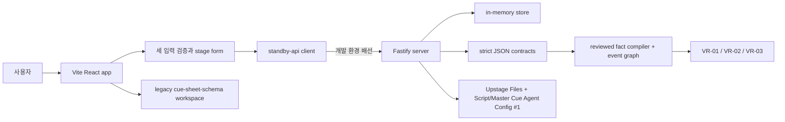

# STANDBY — 현재 구현 기능 명세 (As-Is)

| 항목 | 내용 |
|---|---|
| 문서 상태 | 코드 대조 완료 · 2026-08-22 |
| 기준 스냅샷 | `origin/main`의 `app/`, `server/`, `contracts/` 코드 대조 결과 |
| 목적 | **지금 실제로 동작하는 기능과 아직 동작하지 않는 기능을 구분**한다 |
| 제품 목표 | [PRD_CLAUDE.md](PRD_CLAUDE.md) |
| UI 목표 계약 | [`../Lo-Fi/standby/DESIGN.md`](../Lo-Fi/standby/DESIGN.md) |

> 이 문서는 목표 PRD가 아니라 구현 현황의 정본이다. 코드와 이 문서가 다르면 코드가 우선하며,
> 기능을 변경한 작업자는 같은 PR에서 이 문서를 함께 갱신한다.

---

## 1. 한 문장 현황

현재 STANDBY는 **세 입력을 실제로 수집하고 로컬에서 형식·파일 서명·SHA-256을 확인하는 입력 화면**,
**`cue-sheet-schema`를 검증·재현하는 기존 워크스페이스**, 그리고
**PDF/XLSX 입력·Upstage Agent 추출·사람 검토 게이트를 제공하는 Fastify 백엔드**를 갖는다.
입력 화면은 개발 환경 API client까지 배선됐지만, 운영 인증 백엔드와 실제 workspace projection 연결은 아직 없다.

따라서 현재 workspace의 모순과 무대 상태는 새 입력 화면에서 올린 원 대본·Master Cue를
Upstage가 추출한 결과가 아니다. 입력과 workspace 두 데이터 흐름은 아직 연결되지 않았다.

---

## 2. 구현 상태 요약

| 영역 | 상태 | 현재 동작 |
|---|---|---|
| 두 화면 라우팅 | **구현** | `/` 입력, `/workspace` 워크스페이스만 존재 |
| 세 입력 UI | **구현** | SCRIPT·MASTER_CUE 실제 파일 카드와 구조화된 STAGE_SPEC 폼을 표시. 미리 정한 파일명은 없음 |
| JSON 입력 | **입력 UI에서 제거** | legacy `cue-sheet-schema` store·validator·workspace는 남아 있지만 현재 입력 화면에는 JSON 적재 경로가 없음 |
| 원문 파일 업로드 | **개발 환경 배선** | SCRIPT PDF/DOCX, MASTER_CUE XLSX/PDF를 형식·signature·50 MiB·SHA-256 확인 후 API에 multipart 등록 |
| Upstage 추출 | **live adapter 검증 / 개발 UI 배선** | 합성 Script PDF + Master Cue PDF/XLSX live smoke 통과. 입력 화면의 호출 경로는 개발 환경에서만 연결 |
| Fact/authority 검토 | **입력 authority 구현 / fact UI 없음** | 유효 입력은 REVIEWED로 표시하지만 추출 fact는 UNREVIEWED. review queue 승인 화면은 없음 |
| 이벤트 타임라인 | **구현** | JSON의 cue/event를 가로 타임라인에 렌더링하고 선택 이벤트로 자동 스크롤 |
| 이벤트별 2D 무대 | **구현** | 선택 이벤트까지 action을 순서대로 재생산해 인물/소품의 무대·상수윙·하수윙 상태와 ENTER/EXIT 표시 |
| 모순 표시 | **로컬 JSON 기준 구현** | 8개 규칙을 `ERROR`/`WARNING`으로 계산해 입력 미리보기, 타임라인, 이벤트 상세에 표시 |
| Evidence Trace | **현재 UI 없음** | 로컬 모순은 SCRIPT·MASTER_CUE·STAGE_SPEC locator/quote 3종 근거를 갖지 않음 |
| 큐시트 탐색 | **구현** | cue/event 타임라인 선택과 event/cue 상세 열람 지원 |
| 큐시트 편집 | **화면 미구현** | store에 update/add/remove action은 있으나 현재 화면에서 호출하지 않음 |
| 수정 이력 | **미구현** | store에 revision 껍데기만 있고 snapshot 저장·복원은 TODO |
| finding 결정 기록 | **미구현** | `DECISION_RECORDED` UI와 서버 연결 없음 |
| 원본 hash/revision 영속성 | **미구현** | 새로고침하면 JSON과 선택 상태가 사라지고 프런트는 백엔드 hash 계약을 사용하지 않음 |
| XLSX import/export | **미구현** | 실제 엑셀 읽기·서식 보존·새 파일 내보내기 없음 |
| refresh/변경 감지 | **미구현** | source hash 비교, 변경 문서 재추출, UNREVIEWED 게이트 없음 |
| 프런트–백엔드 연결 | **입력 경로 부분 배선** | 입력 화면이 case→upload→operation→review queue client를 호출. review→snapshot→workspace는 아직 fixture와 분리 |
| 백엔드 API 수직 슬라이스 | **구현** | case→source→비동기 extraction→review→snapshot→workspace→cue revision 흐름을 메모리에서 제공 |
| 실제 Upstage 연동 | **합성 live smoke 통과** | 역할별 저장 Config #1로 PDF/PDF와 PDF/XLSX를 실행해 12 Script + 5 Cue + 3 Stage facts와 전건 `UNREVIEWED`를 확인. 실제 원본 fidelity는 미검증 |
| reviewed fact compiler | **백엔드 구현** | 승인된 `EVENT_STATE`만 8-event graph와 stage snapshot으로 compile. Upstage raw→normalized review UI는 아직 없음 |
| 결정론적 verifier | **통제 fixture 구현** | rules v2가 VR-01 quick-change, VR-02 route capacity, VR-03 prop continuity와 규칙별 기권을 계산 |
| strict JSON 계약 | **계약·decoder·테스트 구현** | 역할별 `script_facts`/`cue_facts`, locator·quote를 fail-closed로 검사하고 새 fact를 `UNREVIEWED`로 격리 |
| 데이터베이스 | **미구현** | 백엔드 재시작 시 case·review·revision이 모두 사라지는 in-memory store |

---

## 3. 현재 프런트 기능

### 3-1. 입력 화면 `/`

1. SCRIPT 카드는 PDF/DOCX, MASTER_CUE 카드는 XLSX/PDF를 실제로 선택하거나 drop할 수 있다.
2. 브라우저는 확장자, 50 MiB 제한, PDF/Office 파일 signature, byte SHA-256을 확인한다.
3. 유효한 파일을 사람이 선택하면 해당 입력 authority가 `REVIEWED`로 바뀐다. 이는 추출 fact 승인이 아니다.
4. STAGE_SPEC에서 crossover, 최소 환복 시간, route 최소·최대 시간, 인물/소품 초기 배치를 구조화해 입력한다.
5. 세 입력이 모두 유효할 때만 `Upstage Fact 추출 시작`이 활성화된다.
6. 개발 환경에서 API base URL과 local token이 설정되면 case 생성→세 source 등록→Upstage extraction→review queue 조회를 실행한다.
7. 운영 빌드는 브라우저 환경변수의 API key를 허용하지 않는다. 서버 인증 경계가 없으면 전송하지 않고 연결 필요 상태를 표시한다.
8. 추출 성공 후 fact는 모두 `UNREVIEWED`로 안내되며 자동으로 verdict나 워크스페이스에 반영되지 않는다.

### 3-2. 워크스페이스 `/workspace`

- 상단 260px 무대, 중앙 event/cue 상세, 하단 180px 가로 타임라인으로 고정되어 있다.
- 타임라인 cue/event를 선택하면 상세와 2D 무대가 해당 시점 상태로 즉시 바뀐다.
- 사람은 원+cyan, 소품은 사각형+amber로 표시한다.
- `ENTER`는 무대 안쪽 방향과 `등장`, `EXIT`는 wing 방향과 `퇴장`으로 표시한다.
- 모순은 `ERROR`/`WARNING` 카드와 타임라인 marker로 표시된다.
- 패널 swap, finding 팝업, Evidence Trace, 셀 이동, 결정 기록은 현재 화면에 없다.

### 3-3. 현재 로컬 검증 규칙

`duplicate_enter`, `no_backstage_crossover`, `insufficient_crossover_time`,
`prop_location_contradiction`, `prop_already_on_stage`, `prop_not_on_stage`,
`exit_without_enter`, `insufficient_costume_time`을 순서 기반 상태 머신으로 계산한다.

이 결과는 PRD의 hard finding 계약과 아직 다르다. `ERROR`/`WARNING`만 있고
`INSUFFICIENT_EVIDENCE`와 세 source evidence가 없으므로 백엔드 verifier 결과로 소개하면 안 된다.

---

## 4. 현재 백엔드 기능

백엔드는 `server/`에서 프런트와 별도로 실행한다. 모든 `/v1` 요청은 정적 bearer token을 요구하고,
상태는 프로세스 메모리에만 저장한다.

| 순서 | Method / Path | 동작 |
|---:|---|---|
| 1 | `POST /v1/cases` | case 생성 |
| 2 | `POST /v1/cases/:caseId/sources/:role` | SCRIPT·MASTER_CUE multipart 파일 또는 STAGE_SPEC JSON 등록 |
| 3 | `POST /v1/cases/:caseId/extraction-runs` | `CONTROLLED_FIXTURE` 또는 `UPSTAGE_AGENT` 비동기 작업 시작 |
| 4 | `GET /v1/operations/:operationId` | `QUEUED/RUNNING/SUCCEEDED/FAILED` extraction 상태 조회 |
| 4-1 | `GET /v1/extraction-runs/:runId` | 역할별 provider job·agent·응답 hash provenance 조회 |
| 5 | `GET /v1/cases/:caseId/review-queue` | 검토 대기 fact 조회 |
| 6 | `POST /v1/cases/:caseId/fact-reviews:batch` | fact를 REVIEWED 또는 REJECTED로 기록 |
| 7 | `POST /v1/cases/:caseId/review-snapshots` | 현재 검토 상태를 고정하고 compile·verify |
| 8 | `GET /v1/cases/:caseId/workspace` | compiled event와 finding projection 조회 |
| 9 | `POST /v1/cases/:caseId/cue-revisions` | base revision/hash를 확인한 cell patch 생성 |
| - | `GET /healthz` | 인증 없이 health 확인 |

현재 rules v2 수직 슬라이스는 다음 상태를 재현한다.

```text
fact 미검토
  → VR-01·VR-02·VR-03 모두 INSUFFICIENT_EVIDENCE

20개 통제 fact 검토 완료
  → 8-event graph
  → VR-01 VIOLATION / VR-02 VIOLATION / VR-03 REVIEW

cue revision으로 환복시간 70s
  → VR-01만 CONSISTENT, 나머지 finding은 유지

tight fixture / clean control
  → VR-01 REVIEW / 세 core finding 0건
```

Upstage의 `ScriptFact`·`CueFact` raw field를 compiler가 추측해서 정규화하지 않는다. 사람이 검토할 때
`corrected_value.normalized_fact_type`과 `value`를 명시하면 compiler가 그 승인된 값만 읽는다.

### 4-1. 구현된 보호 장치

- 허용 origin 기반 CORS
- Helmet 보안 헤더
- 분당 120회 rate limit
- JSON 요청 body 1 MiB, 파일 1개당 50 MiB 제한
- 역할별 확장자·MIME·파일 signature 검사와 파일명 경로 제거
- `/v1` 정적 bearer token 검사
- 쓰기 요청의 `Idempotency-Key` 강제와 재사용 충돌 검사
- source SHA-256과 cue revision의 base hash/revision 검사
- 구조화된 오류 envelope

이는 개발용 보호 장치다. 사용자별 인증·권한, 영속 DB, secret manager, 업로드 파일 저장소,
악성 파일 검사, 운영 audit/observability는 구현되지 않았다.

---

## 5. 현재 연결 구조



현재 시연 가능한 입력 경로는 `사용자 → 세 입력 준비`이고, 개발 환경에서는 extraction 요청까지 배선돼 있다.
워크스페이스는 여전히 별도 legacy 모델이므로 `입력 → review → 실제 finding` 전체를 하나의 E2E 기능으로 소개하면 안 된다.

---

## 6. 현재 데모 합격선

다음 흐름은 지금 프런트에서 동작해야 한다.

```text
SCRIPT PDF/DOCX 선택 + MASTER_CUE XLSX/PDF 선택
  → 형식·signature·50 MiB·SHA-256 확인
  → STAGE_SPEC route·초기 배치 입력
  → 세 입력 REVIEWED + Upstage Fact 추출 시작 활성화
```

추가 확인 항목:

- 선택 전에는 파일명이나 hash를 가정해 표시하지 않는다.
- 잘못된 확장자·signature·빈 파일·50 MiB 초과 파일은 거부한다.
- 입력 authority REVIEWED와 추출 fact UNREVIEWED를 구분해 표시한다.
- 운영 빌드에는 Upstage API key를 포함하지 않는다.

PRD 기준 핵심 데모인 세 원문 업로드 → UNREVIEWED fact review → Evidence Trace 3개 →
결정론적 verdict 흐름은 아직 프런트 E2E로 동작하지 않는다.

---

## 7. PRD 대비 남은 핵심 간극

| 우선 | 간극 | 완료 조건 |
|---|---|---|
| P0 | 실제 reference fidelity | 실제 한국어 대본·17열 Master Cue의 locator, 병합 셀, 줄바꿈, critical token을 사람이 원문과 대조해 gold fact 기준으로 고정함 |
| P0 | 운영 실행·인증 경계 | Railway API/worker와 Supabase Auth·Postgres·private Storage를 연결하고, Vercel SPA에는 공개 API URL과 사용자 세션만 둠 |
| P0 | 프런트–백엔드 완전 연결 | 현재 입력→review queue 이후 normalized fact 검토→snapshot→workspace가 한 case ID로 이어짐 |
| P0 | 실제 fact normalization | 실제 Upstage raw 17개를 EVENT/quick/blocking/prop normalized fact로 사람이 승인하고 rules v2에 투입함 |
| P0 | UI 계약 복구 | 현재 JSON workspace를 PRD의 두 화면·Evidence Trace·`INSUFFICIENT_EVIDENCE` 계약과 정렬함 |
| P1 | 운영 보강 | 사용자별 case 권한·quota, audit log, 악성 파일 검사, 관측성을 갖춤 |
| P1 | 연속 재생 동기화 | 재생 중 타임라인·큐시트·무대가 같은 이벤트로 계속 진행됨 |
| P1 | XLSX 왕복 | 원본 구조·sheet·서식을 유지한 새 파일을 내보내고 재수입 시 같은 fact를 얻음 |
| P2 | refresh gate | hash가 같은 문서는 재호출하지 않고 새 fact는 승인 전 UNREVIEWED로 격리함 |

legacy JSON workspace와 백엔드의 reviewed-fact verifier는 서로 다른 데이터 모델이다. 연결 작업에서
둘 중 하나를 암묵적으로 정본으로 삼지 말고, 백엔드 workspace projection을 프런트 표시 모델로 명시적으로 변환해야 한다.

---

## 8. 문서 사용 규칙

- **지금 되는 것 확인:** 이 문서
- **무엇을 만들어야 하는지 결정:** [PRD_CLAUDE.md](PRD_CLAUDE.md)
- **화면 불변식 확인:** [`../Lo-Fi/standby/DESIGN.md`](../Lo-Fi/standby/DESIGN.md)
- **현재 백엔드 실행·테스트:** [`../server/README.md`](../server/README.md)
- **백엔드 목표 구조와 서비스 경계:** [BACKEND_ARCHITECTURE.md](BACKEND_ARCHITECTURE.md)
- **JSON 경계:** [`../contracts/README.md`](../contracts/README.md)
