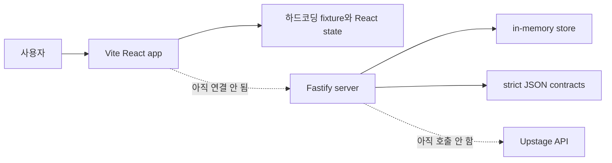

# STANDBY — 현재 구현 기능 명세 (As-Is)

| 항목 | 내용 |
|---|---|
| 문서 상태 | 코드 대조 완료 · 2026-08-22 |
| 기준 스냅샷 | `origin/main`의 `app/`, `server/`, `contracts/` 코드 대조 결과 |
| 목적 | **지금 실제로 동작하는 기능과 아직 동작하지 않는 기능을 구분**한다 |
| 제품 목표 | [PRD_CLAUDE.md](PRD_CLAUDE.md) |
| UI 목표 계약 | [`../Lo-Fi/standby/DESIGN.md`](../Lo-Fi/standby/DESIGN.md) |

> 이 문서는 목표 PRD가 아니라 구현 현황의 정본이다. 코드와 이 문서가 다르면 코드가 우선하며,
> 기능을 변경한 작업자는 같은 PR에서 이 문서를 함께 갱신한다.

---

## 1. 한 문장 현황

현재 STANDBY는 **하드코딩된 공연 fixture를 탐색·편집·재현하는 프런트 데모**와
**통제 fixture의 퀵체인지 한 규칙을 검증하는 독립 Fastify 백엔드**가 각각 동작한다.
두 시스템은 아직 연결되지 않았고, 실제 파일 업로드와 Upstage 호출도 구현되지 않았다.

따라서 현재 웹 화면에서 보이는 finding과 근거는 실제 업로드 문서를 분석한 결과가 아니다.

---

## 2. 구현 상태 요약

| 영역 | 상태 | 현재 동작 |
|---|---|---|
| 두 화면 라우팅 | **구현** | `/` 입력, `/workspace` 워크스페이스만 존재 |
| 세 입력 UI | **부분 구현** | SCRIPT·CUESHEET 카드와 STAGE_SPEC 폼을 표시하고 로컬 상태를 수정할 수 있음 |
| 파일 업로드 | **미구현** | dropzone은 drag hover만 처리하며 파일을 읽거나 저장하지 않음 |
| Upstage 추출 | **미구현** | `Upstage 추출 시작`은 API 호출 없이 `/workspace`로 이동 |
| Fact/authority 검토 | **UI fixture** | REVIEWED 배지는 토글되지만 추출 fact나 판정 입력과 연결되지 않음 |
| 이벤트 타임라인 | **부분 구현** | E1~E8 선택·이전·다음 가능. 재생 버튼은 다음 이벤트로 한 번 이동할 뿐 연속 재생하지 않음 |
| 이벤트별 2D 무대 | **구현** | E1~E8별 정적 스냅샷, 인물/소품 위치, ENTER/EXIT 방향·라벨 표시 |
| finding 표시 | **UI fixture** | E3 `VIOLATION`, E5 `REVIEW`, E6 `INSUFFICIENT_EVIDENCE` 상세를 하드코딩 데이터로 표시 |
| Evidence Trace | **UI fixture** | finding 상세에 SCRIPT·CUESHEET·STAGE_SPEC 근거 카드 3개 표시 |
| 큐시트 탐색 | **구현** | 행 marker, 선택 행, 열 표시 토글, 패널 내부 가로 스크롤 지원 |
| 큐시트 편집 | **인메모리 구현** | 셀 수정은 draft로 유지하고, 저장할 때 revision을 생성한 뒤 E3를 재판정 |
| 수정 이력 | **인메모리 구현** | 현재 탭 안에서 revision 목록·hover preview·과거 revision 불러오기 지원 |
| finding 결정 기록 | **인메모리 구현** | `DECISION_RECORDED` 버튼 상태만 현재 탭에 보존 |
| 원본 hash/revision 영속성 | **미구현** | 새로고침하면 편집·이력·결정이 모두 사라짐. 프런트는 백엔드 hash 계약을 사용하지 않음 |
| XLSX import/export | **미구현** | 실제 엑셀 읽기·서식 보존·새 파일 내보내기 없음 |
| refresh/변경 감지 | **미구현** | source hash 비교, 변경 문서 재추출, UNREVIEWED 게이트 없음 |
| 프런트–백엔드 연결 | **미구현** | `app/`에는 `/v1` 호출 코드가 없음 |
| 백엔드 API 수직 슬라이스 | **구현** | case→source→fixture extraction→review→snapshot→workspace→cue revision 흐름을 메모리에서 제공 |
| 실제 Upstage 연동 | **미구현** | API key를 읽거나 Upstage API를 호출하는 adapter가 없음 |
| 결정론적 verifier | **부분 구현** | 백엔드는 `VR-01 QUICK_CHANGE_IMPOSSIBLE` 통제 fixture만 계산 |
| strict JSON 계약 | **계약·테스트 구현** | `contracts/`의 스키마를 테스트하지만, 브라우저 업로드에서 생성·교환하는 흐름은 아직 없음 |
| 데이터베이스 | **미구현** | 백엔드 재시작 시 case·review·revision이 모두 사라지는 in-memory store |

---

## 3. 현재 프런트 기능

### 3-1. 입력 화면 `/`

1. SCRIPT와 CUESHEET 카드에는 미리 정해진 파일명·hash·origin이 표시된다.
2. 각 REVIEWED 배지는 화면 안에서만 토글할 수 있다.
3. STAGE_SPEC에서 다음 값을 로컬로 수정할 수 있다.
   - 상수/하수 wing 유무
   - crossover `true` / `false` / `UNKNOWN`
   - route와 최소·최대 시간
   - actors, props, costumes의 initial state
4. dropzone에 파일을 놓아도 파일명·hash·내용은 바뀌지 않는다.
5. `Upstage 추출 시작`을 누르면 입력값 검증이나 네트워크 요청 없이 워크스페이스로 이동한다.

### 3-2. 워크스페이스 `/workspace`

- 위·아래 패널은 같은 높이를 유지하며 `패널 전환`으로 무대와 큐시트 위치를 맞바꾼다.
- 타임라인 이벤트를 선택하면 해당 이벤트가 활성화되고 finding 팝업이 아래 패널만 덮는다.
- 현재 이벤트가 바뀌면 2D 무대는 그 이벤트의 정적 스냅샷으로 즉시 바뀐다.
- 사람은 원+cyan, 소품은 사각형+amber로 표시한다.
- `ENTER`는 무대 안쪽 방향과 `등장`, `EXIT`는 wing 방향과 `퇴장`으로 표시한다.
- 팝업의 `이 위치로 이동`은 연결된 큐시트 셀에 포커스를 옮기고 finding marker는 유지한다.
- `DECISION_RECORDED`는 verdict나 원본을 변경하지 않는다.

### 3-3. 큐시트 편집과 재판정

1. 셀 클릭 후 입력한 값은 저장 전까지 draft다.
2. `모두 취소`는 현재 draft 전체를 버린다.
3. `저장`은 현재 메모리의 행에 patch를 반영하고 revision을 하나 만든다.
4. 저장 직후 재판정하는 것은 E3 한 건뿐이다.
5. R3 `환복시간`에서 처음 발견한 정수가 `66` 이상이면 E3는 `CONSISTENT`, 그 외에는 `VIOLATION`이 된다.
6. 예: `58s`를 `70s`로 바꾸고 저장하면 E3가 `CONSISTENT`로 바뀐다.
7. 저장 이력은 현재 브라우저 탭의 React state에만 있으며 서버에 기록되지 않는다.

### 3-4. 현재 fixture

| 이벤트 | 표시 상태 | 규칙/의미 |
|---|---|---|
| E3 | `VIOLATION` | `VR-01`, available `58–62s` vs required `66–68s` |
| E5 | `REVIEW` | `VR-03` 소품 연속성 검토 fixture |
| E6 | `INSUFFICIENT_EVIDENCE` | `VR-02` 동선 판정에 필요한 근거 부족 fixture |
| 그 외 | `CONSISTENT` | finding 상세 없음 |

제품 도메인의 finding verdict는 `VIOLATION` / `REVIEW` / `INSUFFICIENT_EVIDENCE` 세 가지다.
현재 프런트의 `Verdict` 타입은 화면 집계 상태인 `CONSISTENT`와 편집 표시인 `EDITED`도 함께 담고 있다.
이는 현재 구현상의 타입 혼합이며, `CONSISTENT`·`EDITED`를 hard finding verdict로 해석하면 안 된다.

---

## 4. 현재 백엔드 기능

백엔드는 `server/`에서 프런트와 별도로 실행한다. 모든 `/v1` 요청은 정적 bearer token을 요구하고,
상태는 프로세스 메모리에만 저장한다.

| 순서 | Method / Path | 동작 |
|---:|---|---|
| 1 | `POST /v1/cases` | case 생성 |
| 2 | `POST /v1/cases/:caseId/sources/:role` | 세 역할의 JSON `content`와 metadata 등록 |
| 3 | `POST /v1/cases/:caseId/extraction-runs` | 실제 Upstage 대신 통제 fixture fact 생성 |
| 4 | `GET /v1/operations/:operationId` | 완료된 extraction operation 조회 |
| 5 | `GET /v1/cases/:caseId/review-queue` | 검토 대기 fact 조회 |
| 6 | `POST /v1/cases/:caseId/fact-reviews:batch` | fact를 REVIEWED 또는 REJECTED로 기록 |
| 7 | `POST /v1/cases/:caseId/review-snapshots` | 현재 검토 상태를 고정하고 compile·verify |
| 8 | `GET /v1/cases/:caseId/workspace` | compiled event와 finding projection 조회 |
| 9 | `POST /v1/cases/:caseId/cue-revisions` | base revision/hash를 확인한 cell patch 생성 |
| - | `GET /healthz` | 인증 없이 health 확인 |

현재 검증 수직 슬라이스는 다음 세 상태를 재현한다.

```text
fact 미검토
  → INSUFFICIENT_EVIDENCE

fact 검토 완료 + 환복시간 58s
  → VR-01 VIOLATION

cue revision으로 환복시간 70s
  → finding 0건 / CONSISTENT
```

### 4-1. 구현된 보호 장치

- 허용 origin 기반 CORS
- Helmet 보안 헤더
- 분당 120회 rate limit
- 요청 body 1 MiB 제한
- `/v1` 정적 bearer token 검사
- 쓰기 요청의 `Idempotency-Key` 강제와 재사용 충돌 검사
- source SHA-256과 cue revision의 base hash/revision 검사
- 구조화된 오류 envelope

이는 개발용 보호 장치다. 사용자별 인증·권한, 영속 DB, secret manager, 업로드 파일 저장소,
악성 파일 검사, 운영 audit/observability는 구현되지 않았다.

---

## 5. 현재 연결 구조



현재 시연 가능한 경로는 `사용자 → app fixture`이고, 테스트 가능한 백엔드 경로는
`API client/test → server fixture → deterministic VR-01`이다. 둘을 하나의 E2E 기능으로 소개하면 안 된다.

---

## 6. 현재 데모 합격선

다음 흐름은 지금 프런트에서 동작해야 한다.

```text
E3 카드 클릭
  → VIOLATION 팝업과 58–62s vs 66–68s, Evidence Trace 3개 확인
  → 이 위치로 이동
  → 큐시트 R3 환복시간 셀 확인
  → 58s를 70s로 수정하고 저장
  → E3가 CONSISTENT로 변경
```

추가 확인 항목:

- E1~E8 선택 시 무대 snapshot이 달라진다.
- ENTER/EXIT 이벤트에 방향과 한글 라벨이 함께 보인다.
- 팝업은 아래 패널만 덮고 위 패널은 유지된다.
- 패널을 바꿔도 두 패널 높이가 같다.
- 페이지 전체에는 가로 스크롤이 생기지 않고 큐시트 내부만 스크롤된다.

---

## 7. PRD 대비 남은 핵심 간극

| 우선 | 간극 | 완료 조건 |
|---|---|---|
| P0 | 실제 입력 수집 | 업로드한 SCRIPT·MASTER_CUE와 작성한 STAGE_SPEC이 immutable source+hash로 서버에 등록됨 |
| P0 | Upstage adapter | Parse/Classify/Extract 결과를 strict fact 계약으로 수신하며 실패·재시도·provenance를 기록함 |
| P0 | 프런트–백엔드 연결 | 입력→review queue→snapshot→workspace가 fixture import 없이 한 case ID로 이어짐 |
| P0 | 검증 규칙 완성 | `VR-01`, `VR-02`, `VR-03`이 reviewed fact와 세 source evidence로 결정론적으로 실행됨 |
| P1 | 영속성과 권한 | 사용자별 case 접근 제어, DB/object storage, audit log를 갖춤 |
| P1 | 연속 재생 동기화 | 재생 중 타임라인·큐시트·무대가 같은 이벤트로 계속 진행됨 |
| P1 | XLSX 왕복 | 원본 구조·sheet·서식을 유지한 새 파일을 내보내고 재수입 시 같은 fact를 얻음 |
| P2 | refresh gate | hash가 같은 문서는 재호출하지 않고 새 fact는 승인 전 UNREVIEWED로 격리함 |

하드코딩 콘텐츠를 실제 API 데이터로 교체하는 작업은 별도 작업으로 다룬다. 그 전까지는
프런트 fixture와 백엔드 fixture를 같은 데이터 흐름이라고 가정하지 않는다.

---

## 8. 문서 사용 규칙

- **지금 되는 것 확인:** 이 문서
- **무엇을 만들어야 하는지 결정:** [PRD_CLAUDE.md](PRD_CLAUDE.md)
- **화면 불변식 확인:** [`../Lo-Fi/standby/DESIGN.md`](../Lo-Fi/standby/DESIGN.md)
- **현재 백엔드 실행·테스트:** [`../server/README.md`](../server/README.md)
- **백엔드 목표 구조와 서비스 경계:** [BACKEND_ARCHITECTURE.md](BACKEND_ARCHITECTURE.md)
- **JSON 경계:** [`../contracts/README.md`](../contracts/README.md)
