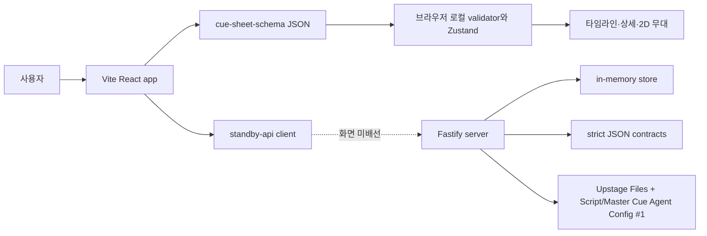

# STANDBY — 현재 구현 기능 명세 (As-Is)

| 항목 | 내용 |
|---|---|
| 문서 상태 | 코드 대조 완료 · 2026-08-22 |
| 기준 스냅샷 | `origin/main`의 `app/`, `server/`, `contracts/` 코드 대조 결과 |
| 목적 | **지금 실제로 동작하는 기능과 아직 동작하지 않는 기능을 구분**한다 |
| 제품 목표 | [PRD_CLAUDE.md](PRD_CLAUDE.md) |
| UI 목표 계약 | [`../Lo-Fi/standby/DESIGN.md`](../Lo-Fi/standby/DESIGN.md) |

> 이 문서는 목표 PRD가 아니라 구현 현황의 정본이다. 코드와 이 문서가 다르면 코드가 우선하며,
> 기능을 변경한 작업자는 같은 PR에서 이 문서를 함께 갱신한다.

---

## 1. 한 문장 현황

현재 STANDBY는 **사람 또는 별도 변환기가 만든 `cue-sheet-schema` JSON을 브라우저에서 검증·재현하는
프런트**와 **실제 PDF/XLSX 입력·Upstage Agent 추출·사람 검토 게이트를 제공하는 Fastify 백엔드**가
각각 동작한다. 프런트 API client는 존재하지만 현재 두 화면에는 배선되지 않았다.

따라서 현재 웹 화면의 모순과 무대 상태는 업로드한 JSON에서 계산되지만, 원 대본·Master Cue를
Upstage가 추출한 결과는 아니다. 두 데이터 흐름은 아직 연결되지 않았다.

---

## 2. 구현 상태 요약

| 영역 | 상태 | 현재 동작 |
|---|---|---|
| 두 화면 라우팅 | **구현** | `/` 입력, `/workspace` 워크스페이스만 존재 |
| 세 입력 UI | **미구현** | 현재 입력 화면은 통합 JSON 하나만 받으며 SCRIPT·MASTER_CUE·STAGE_SPEC 원본을 받지 않음 |
| JSON 입력 | **구현** | `.json`을 읽어 `metadata`, `venue`, `characters`, `props`, `cues[].events` 최소 구조를 확인하고 Zustand에 적재 |
| 원문 파일 업로드 | **백엔드 구현 / UI 미배선** | SCRIPT PDF/DOCX, MASTER_CUE XLSX/PDF를 multipart로 받고 byte SHA-256을 고정 |
| Upstage 추출 | **live adapter 검증 / UI 미배선** | Files API → 역할별 Agent/Config #1 job → polling → strict decoder를 합성 Script PDF + Master Cue PDF/XLSX로 실제 통과 |
| Fact/authority 검토 | **백엔드 구현 / UI 없음** | review queue와 snapshot API는 있으나 현재 화면에서 확인·승인할 수 없음 |
| 이벤트 타임라인 | **구현** | JSON의 cue/event를 가로 타임라인에 렌더링하고 선택 이벤트로 자동 스크롤 |
| 이벤트별 2D 무대 | **구현** | 선택 이벤트까지 action을 순서대로 재생산해 인물/소품의 무대·상수윙·하수윙 상태와 ENTER/EXIT 표시 |
| 모순 표시 | **로컬 JSON 기준 구현** | 8개 규칙을 `ERROR`/`WARNING`으로 계산해 입력 미리보기, 타임라인, 이벤트 상세에 표시 |
| Evidence Trace | **현재 UI 없음** | 로컬 모순은 SCRIPT·MASTER_CUE·STAGE_SPEC locator/quote 3종 근거를 갖지 않음 |
| 큐시트 탐색 | **구현** | cue/event 타임라인 선택과 event/cue 상세 열람 지원 |
| 큐시트 편집 | **화면 미구현** | store에 update/add/remove action은 있으나 현재 화면에서 호출하지 않음 |
| 수정 이력 | **미구현** | store에 revision 껍데기만 있고 snapshot 저장·복원은 TODO |
| finding 결정 기록 | **미구현** | `DECISION_RECORDED` UI와 서버 연결 없음 |
| 원본 hash/revision 영속성 | **미구현** | 새로고침하면 JSON과 선택 상태가 사라지고 프런트는 백엔드 hash 계약을 사용하지 않음 |
| XLSX import/export | **미구현** | 실제 엑셀 읽기·서식 보존·새 파일 내보내기 없음 |
| refresh/변경 감지 | **미구현** | source hash 비교, 변경 문서 재추출, UNREVIEWED 게이트 없음 |
| 프런트–백엔드 연결 | **client 구현 / 화면 미배선** | `app/src/lib/standby-api.ts`에 case→upload→operation→review→snapshot client가 있으나 화면은 fixture 상태 |
| 백엔드 API 수직 슬라이스 | **구현** | case→source→비동기 extraction→review→snapshot→workspace→cue revision 흐름을 메모리에서 제공 |
| 실제 Upstage 연동 | **합성 live smoke 통과** | 역할별 저장 Config #1로 PDF/PDF와 PDF/XLSX를 실행해 12 Script + 5 Cue + 3 Stage facts와 전건 `UNREVIEWED`를 확인. 실제 원본 fidelity는 미검증 |
| 결정론적 verifier | **부분 구현** | 백엔드는 `VR-01 QUICK_CHANGE_IMPOSSIBLE` 통제 fixture만 계산 |
| strict JSON 계약 | **계약·decoder·테스트 구현** | 역할별 `script_facts`/`cue_facts`, locator·quote를 fail-closed로 검사하고 새 fact를 `UNREVIEWED`로 격리 |
| 데이터베이스 | **미구현** | 백엔드 재시작 시 case·review·revision이 모두 사라지는 in-memory store |

---

## 3. 현재 프런트 기능

### 3-1. 입력 화면 `/`

1. `.json` 파일 하나를 드래그하거나 선택한다.
2. 브라우저에서 JSON을 파싱하고 필수 최상위 필드와 `cues[].events` 존재만 최소 검사한다.
3. 성공하면 공연명, 인물·소품·cue 수, backstage crossover 여부와 모순 건수를 표시한다.
4. 데이터는 Zustand 메모리에만 적재되며 백엔드와 Upstage를 호출하지 않는다.
5. JSON이 로드된 경우에만 `워크스페이스 열기`가 활성화된다.

### 3-2. 워크스페이스 `/workspace`

- 상단 260px 무대, 중앙 event/cue 상세, 하단 180px 가로 타임라인으로 고정되어 있다.
- 타임라인 cue/event를 선택하면 상세와 2D 무대가 해당 시점 상태로 즉시 바뀐다.
- 사람은 원+cyan, 소품은 사각형+amber로 표시한다.
- `ENTER`는 무대 안쪽 방향과 `등장`, `EXIT`는 wing 방향과 `퇴장`으로 표시한다.
- 모순은 `ERROR`/`WARNING` 카드와 타임라인 marker로 표시된다.
- 패널 swap, finding 팝업, Evidence Trace, 셀 이동, 결정 기록은 현재 화면에 없다.

### 3-3. 현재 로컬 검증 규칙

`duplicate_enter`, `no_backstage_crossover`, `insufficient_crossover_time`,
`prop_location_contradiction`, `prop_already_on_stage`, `prop_not_on_stage`,
`exit_without_enter`, `insufficient_costume_time`을 순서 기반 상태 머신으로 계산한다.

이 결과는 PRD의 hard finding 계약과 아직 다르다. `ERROR`/`WARNING`만 있고
`INSUFFICIENT_EVIDENCE`와 세 source evidence가 없으므로 백엔드 verifier 결과로 소개하면 안 된다.

---

## 4. 현재 백엔드 기능

백엔드는 `server/`에서 프런트와 별도로 실행한다. 모든 `/v1` 요청은 정적 bearer token을 요구하고,
상태는 프로세스 메모리에만 저장한다.

| 순서 | Method / Path | 동작 |
|---:|---|---|
| 1 | `POST /v1/cases` | case 생성 |
| 2 | `POST /v1/cases/:caseId/sources/:role` | SCRIPT·MASTER_CUE multipart 파일 또는 STAGE_SPEC JSON 등록 |
| 3 | `POST /v1/cases/:caseId/extraction-runs` | `CONTROLLED_FIXTURE` 또는 `UPSTAGE_AGENT` 비동기 작업 시작 |
| 4 | `GET /v1/operations/:operationId` | `QUEUED/RUNNING/SUCCEEDED/FAILED` extraction 상태 조회 |
| 4-1 | `GET /v1/extraction-runs/:runId` | 역할별 provider job·agent·응답 hash provenance 조회 |
| 5 | `GET /v1/cases/:caseId/review-queue` | 검토 대기 fact 조회 |
| 6 | `POST /v1/cases/:caseId/fact-reviews:batch` | fact를 REVIEWED 또는 REJECTED로 기록 |
| 7 | `POST /v1/cases/:caseId/review-snapshots` | 현재 검토 상태를 고정하고 compile·verify |
| 8 | `GET /v1/cases/:caseId/workspace` | compiled event와 finding projection 조회 |
| 9 | `POST /v1/cases/:caseId/cue-revisions` | base revision/hash를 확인한 cell patch 생성 |
| - | `GET /healthz` | 인증 없이 health 확인 |

현재 검증 수직 슬라이스는 다음 세 상태를 재현한다.

```text
fact 미검토
  → INSUFFICIENT_EVIDENCE

fact 검토 완료 + 환복시간 58s
  → VR-01 VIOLATION

cue revision으로 환복시간 70s
  → finding 0건 / CONSISTENT
```

### 4-1. 구현된 보호 장치

- 허용 origin 기반 CORS
- Helmet 보안 헤더
- 분당 120회 rate limit
- JSON 요청 body 1 MiB, 파일 1개당 50 MiB 제한
- 역할별 확장자·MIME·파일 signature 검사와 파일명 경로 제거
- `/v1` 정적 bearer token 검사
- 쓰기 요청의 `Idempotency-Key` 강제와 재사용 충돌 검사
- source SHA-256과 cue revision의 base hash/revision 검사
- 구조화된 오류 envelope

이는 개발용 보호 장치다. 사용자별 인증·권한, 영속 DB, secret manager, 업로드 파일 저장소,
악성 파일 검사, 운영 audit/observability는 구현되지 않았다.

---

## 5. 현재 연결 구조



현재 시연 가능한 경로는 `사용자 → 통합 JSON → app 로컬 validator`이고, 테스트 가능한 백엔드 경로는
`API client/test → server fixture → deterministic VR-01`이다. 둘을 하나의 E2E 기능으로 소개하면 안 된다.

---

## 6. 현재 데모 합격선

다음 흐름은 지금 프런트에서 동작해야 한다.

```text
cue-sheet-schema JSON 선택
  → 구조 검사와 ERROR/WARNING 요약
  → 워크스페이스 열기
  → cue/event 선택
  → event 상세·모순·2D 무대 상태가 함께 변경
```

추가 확인 항목:

- cue/event 수와 무관하게 타임라인이 가로 스크롤된다.
- 선택 event까지 action을 재생산한 무대 상태가 표시된다.
- ENTER/EXIT 이벤트에 방향과 한글 라벨이 함께 보인다.
- crossover 없음과 반대 wing 재등장/소품 이동이 `ERROR`로 표시된다.

PRD 기준 핵심 데모인 세 원문 업로드 → UNREVIEWED fact review → Evidence Trace 3개 →
결정론적 verdict 흐름은 아직 프런트 E2E로 동작하지 않는다.

---

## 7. PRD 대비 남은 핵심 간극

| 우선 | 간극 | 완료 조건 |
|---|---|---|
| P0 | 실제 입력 수집 UI 배선 | SCRIPT·MASTER_CUE·STAGE_SPEC 입력이 API client를 호출해 immutable source+hash를 서버에 등록함 |
| P0 | 실제 reference fidelity | 실제 한국어 대본·17열 Master Cue의 locator, 병합 셀, 줄바꿈, critical token을 사람이 원문과 대조해 gold fact 기준으로 고정함 |
| P0 | 프런트–백엔드 연결 | 입력→review queue→snapshot→workspace가 fixture import 없이 한 case ID로 이어짐 |
| P0 | 검증 규칙 완성 | `VR-01`, `VR-02`, `VR-03`이 reviewed fact와 세 source evidence로 결정론적으로 실행됨 |
| P0 | UI 계약 복구 | 현재 JSON workspace를 PRD의 두 화면·Evidence Trace·`INSUFFICIENT_EVIDENCE` 계약과 정렬함 |
| P1 | 영속성과 권한 | 사용자별 case 접근 제어, DB/object storage, audit log를 갖춤 |
| P1 | 연속 재생 동기화 | 재생 중 타임라인·큐시트·무대가 같은 이벤트로 계속 진행됨 |
| P1 | XLSX 왕복 | 원본 구조·sheet·서식을 유지한 새 파일을 내보내고 재수입 시 같은 fact를 얻음 |
| P2 | refresh gate | hash가 같은 문서는 재호출하지 않고 새 fact는 승인 전 UNREVIEWED로 격리함 |

통합 JSON 로컬 validator와 백엔드의 reviewed-fact verifier는 서로 다른 데이터 모델이다. 연결 작업에서
둘 중 하나를 암묵적으로 정본으로 삼지 말고, 백엔드 workspace projection을 프런트 표시 모델로 명시적으로
변환해야 한다.

---

## 8. 문서 사용 규칙

- **지금 되는 것 확인:** 이 문서
- **무엇을 만들어야 하는지 결정:** [PRD_CLAUDE.md](PRD_CLAUDE.md)
- **화면 불변식 확인:** [`../Lo-Fi/standby/DESIGN.md`](../Lo-Fi/standby/DESIGN.md)
- **현재 백엔드 실행·테스트:** [`../server/README.md`](../server/README.md)
- **백엔드 목표 구조와 서비스 경계:** [BACKEND_ARCHITECTURE.md](BACKEND_ARCHITECTURE.md)
- **JSON 경계:** [`../contracts/README.md`](../contracts/README.md)
